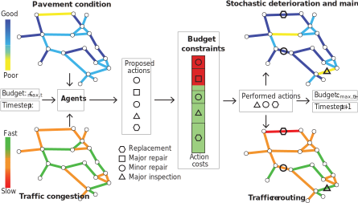
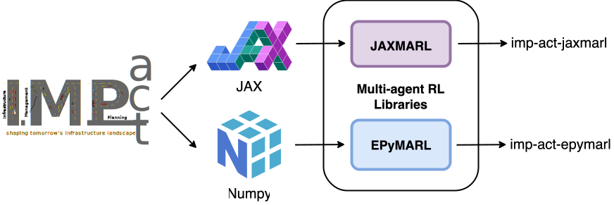

<p align="center">
  
</p>

<h2 align="center">IMP-act: Benchmarking MARL for Infrastructure Management Planning at Scale with JAX</h2>


[](LICENSE)

This repository is the official implementation of the research and environments described in *IMP-act: Benchmarking MARL for Infrastructure Management Planning at Scale with JAX*.

Please refer to `imp-act-JaxMARL` for a full reproduction guide of all results presented in the paper.

## Environment Overview 🌍
The infrastructure management planning (imp-act) environment simulates a real-world road network consisting of multiple road edges, decomposed into distinct road segments, which must be adequately maintained over a planning horizon. The environment involves multiple agents, where each agent is responsible for maintaining a road segment in order to minimize certain shared objectives while meeting specific budget constraints.

<p align="center">
  
 </p>

## Backends ⚙️

<p align="center">
  
</p>

IMP-act provides two environment backends:
- **🧮 NumPy environments**  
  Ideal for prototyping with PyTorch on smaller environments and integration with PyTorch-based MARL frameworks such as [PyMARL](https://github.com/oxwhirl/pymarl) or [EPyMARL](https://github.com/uoe-agents/epymarl). See our [EPyMARL adaptation](https://github.com/AI-for-Infrastructure-Management/imp-act-EPyMARL) for details.

- **⚡ JAX environments**  
  Highly optimized for scalability and parallelization on GPUs/TPUs. Used for large-scale experiments in our paper and for integration with [JaxMARL](https://github.com/FLAIROx/JaxMARL). See our [JaxMARL adaptation](https://github.com/AI-for-Infrastructure-Management/imp-act-JaxMARL) for details.

Both environments have been tested for equivalence via unit tests (see `tests/test_jax_environment.py` directory).

## Installation 🛠️

To set up the environment and install requirements:

### 1. Prerequisites 📋
* 🐍 Python: >=3.7, <3.11 (Note: For using PyMARL or EPyMARL with the NumPy Python < 3.10 is required).
* 📜 Poetry: 1.7.1+ (if using Poetry for environment management).
* ⚙️ Ensure JAX is installed correctly for your specific hardware (CPU/GPU/TPU). Refer to the [official JAX installation guide](https://github.com/google/jax#installation).
* 🔖 We recommend using `jax==0.4.30` as it was used for the experiments in the paper.

### 2. Create a virtual environment 🌐
#### Option A : Create a conda environment using the environment YAML file,
```bash
conda env create -f conda_environment.yaml
conda activate impact-env
```

#### Option B: Create a virtual environment impact-env using venv/poetry etc.
```bash
# create `impact-env` with python=3.10
pip install poetry==1.7.1 lockfile==0.12.2
```

### 3. Install dependencies 📦

#### Option 1: Using Poetry (Recommended)

The flags `--with dev,vis,jax,jax_gpu` are optional and can be used to install additional 
dependencies for development, visualization, JAX support, and JAX GPU support.
See the `pyproject.toml` file to see which dependencies are included in each group.
```bash
poetry install --with dev,vis,jax
```

#### Option 2: Using pip
If you prefer to use pip, you can install the required packages as follows:
```bash
pip install -r requirements/requirements.txt
pip install -e .
``` 

### 4. Verify Installation (Optional) ✅
To verify that the installation was successful, you can run the following command:
```bash
# ensure you are in the root directory of the repository, and pytest is installed
pytest -v
```

## Getting Started 🚀

### Example: Using the JAX Environment

```python
import jax
from imp_act import make

key = jax.random.PRNGKey(42)
key, reset_key, act_key, step_key = jax.random.split(key, 4)

# Initialize an IMP-act JAX environment
env = make("ToyExample-v2-jax")

# Reset the environment
obs, state = env.reset(reset_key)

# Samples random actions for all agents
actions = env.action_space().sample(act_key)

# Step the environment
next_obs, next_state, rewards, dones, infos = env.step(step_key, state, actions)
```

### Example: Using the NumPy Environment

```python
import numpy as np
from imp_act import make

# Initialize an IMP-act NumPy environment
env = make("ToyExample-v2")

# Reset the environment
obs = env.reset()

# Samples random actions for all agents
actions = np.random.randint(len(env.action_map), size=env.num_edges)
actions = actions.reshape(-1, 1) # reshape to (num_edges, 1)

# Step the environment
next_obs, reward, done, info = env.step(actions)
```

## Results 📈

Normalized best policy returns, for all tested IMP-act environments and MARL algorithms over 10 training seeds. Returns are normalized with respect to the baseline heuristic policy $\text{H}_\text{PS}$.

<details>
<summary>Detailed Results</summary>

Best performance per algorithm in terms of expected return, 95% CI, and required VRAM for each environment. The best performance per environment is highlighted in bold, and performances within their 95% CI are marked with *.

### **Toy-Example** ($\text{H}_\text{PS}=-274\text{M}$)

| Algorithm           | $\Delta \bar{R}^{\pi}_0$ | 95% CI             | VRAM (GB) |
| :------------------ | -----------------------: | :----------------: | -----------: |
| VDN                 | *+22.09%                 | [21.35, 22.81]   | 0.52         |
| QMIX                | *+21.37%                 | [20.54, 22.15]   | 1.55         |
| PQN-VDN             | **+22.72%**                 | [21.98, 23.46]   | 0.16         |
| MAPPO               | +19.22%                  | [18.38, 20.04]   | 0.85         |
| IPPO                | +20.54%                  | [19.76, 21.30]   | 1.87         |
| $\text{VDN}_{\text{BA}}$ | +23.04%                  | [20.69, 25.31]   | --           |

### **Cologne** ($\text{H}_\text{PS}=-8.2\text{B}$)

| Algorithm           | $\Delta \bar{R}^{\pi}_0$ | 95% CI             | VRAM (GB) |
| :------------------ | -----------------------: | :----------------: | -----------: |
| VDN                 | **+22.88%** | [22.59, 23.16]   | 5.94         |
| QMIX                | +21.48%                  | [21.17, 21.80]   | 7.72         |
| PQN-VDN             | +20.01%                  | [19.70, 20.30]   | 0.77         |
| MAPPO               | +17.85%                  | [17.51, 18.17]   | 13.13        |
| IPPO                | +12.62%                  | [12.30, 12.93]   | 1.29         |
| $\text{VDN}_{\text{BA}}$ | +24.57%                  | [23.67, 25.42]   | --           |

### **CologneBonn-Dusseldorf** ($\text{H}_\text{PS}=-33.1\text{B}$)

| Algorithm           | $\Delta \bar{R}^{\pi}_0$ | 95% CI             | VRAM (GB) |
| :------------------ | -----------------------: | :----------------: | -----------: |
| VDN                 | **+24.91%** | [24.71, 25.10]   | 12.09        |
| QMIX                | +20.19%                  | [19.97, 20.40]   | 10.37        |
| PQN-VDN             | +21.24%                  | [21.04, 21.45]   | 2.29         |
| MAPPO               | +3.89%                   | [3.67, 4.10]     | 16.45        |
| IPPO                | -15.03%                  | [-15.31, -14.75] | 2.14         |
| $\text{VDN}_{\text{BA}}$ | +25.70%                  | [25.09, 26.29]   | --           |

</details>

## Extending the Environments 🧩
Researchers can modify simulation parameters through the environment configuration files. Each environment has a YAML configuration files under `imp_act/environments/presets/`, where budgets, traffic assignment parameters, maintenance parameters etc. can be modified. 

In addition to modifying these settings, researchers can also add new maps. We provide a script [`create_large_graph.py`](imp_act/environments/dev/create_large_graph.py), located in `imp_act/environments/dev/`, which can:
- 🗺️ Export subgraphs from the European road network by coordinate range.
- 🌍 Export full country-level graphs (e.g., `-c BE` for Belgium).
- 📊 Optionally attach traffic demand data to the new network.

## Citation 
If you use this code in your research, please cite our paper as soon as it is published. The BibTeX entry will be provided here.