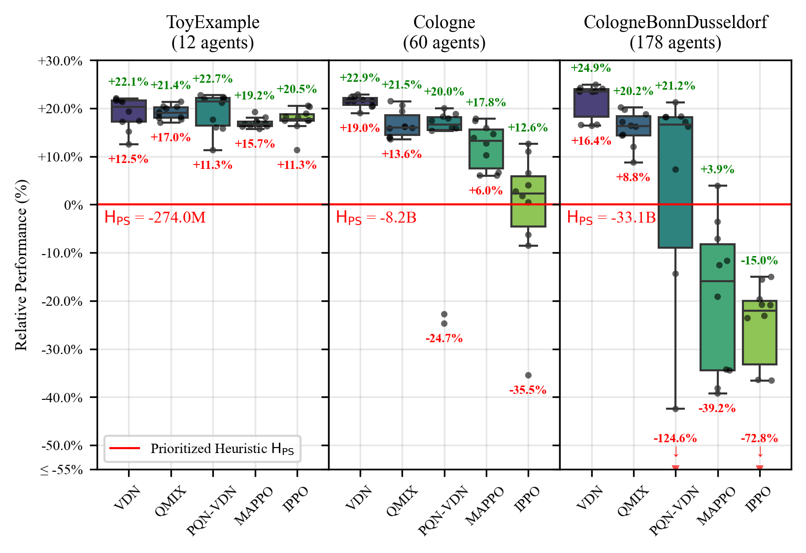

# IMP-act: Benchmarking MARL for Infrastructure Management Planning at Scale with JAX

This repository is the official implementation of the research and environments described in "IMP-act: Benchmarking MARL for Infrastructure Management Planning at Scale with JAX". 

* **Code Repositories:**
    * Main IMP-act Environment: [AI-for-Infrastructure-Management/imp-act](https://github.com/AI-for-Infrastructure-Management/imp-act)
    * JaxMARL Adaptation for IMP-act: [AI-for-Infrastructure-Management/imp-act-JaxMARL](https://github.com/AI-for-Infrastructure-Management/imp-act-JaxMARL)
    * Starter Kit: [AI-for-Infrastructure-Management/imp-act-starter-kit](https://github.com/AI-for-Infrastructure-Management/imp-act-starter-kit)
* **Reproducibility:** Please refer to `imp-act-JaxMARL` for a full reproduction guide of all results presented in the paper.

## Installation

To set up the environment and install requirements:

### 1. Prerequisites
* Python: >=3.7, <3.11 (Note: For using PyMARL or EPyMARL with the NumPy version via the starter-kit, Python < 3.10 is required).
* Poetry: 1.7.1+ (if using Poetry for environment management).
* Ensure JAX is installed correctly for your specific hardware (CPU/GPU/TPU). Refer to the [official JAX installation guide](https://github.com/google/jax#installation).
* We recommend using using `jax==0.4.30` as it was used for the experiments in the paper.

### 2. Create a virtual environment
#### Option A : Create a conda environment using the environment YAML file,
```bash
conda env create -f conda_environment.yaml
conda activate impact-env
```

#### Option B: Create a virtual environment impact-env using venv/poetry etc.
```bash
# create `impact-env` with python=3.10
pip install poetry==1.7.1 lockfile==0.12.2
```

### 3. Install dependencies

#### Option 1: Using Poetry (Recommended)

The flags `--with dev,vis,jax,jax_gpu` are optional and can be used to install additional 
dependencies for development, visualization, JAX support, and JAX GPU support.
See the `pyproject.toml` file to see which dependencies are included in each group.
```bash
poetry install --with dev,vis,jax
```

#### Option 2: Using pip
If you prefer to use pip, you can install the required packages as follows:
```bash
pip install -r requirements/requirements.txt
pip install -e .
``` 

### 4. Verify Installation (Optional)
To verify that the installation was successful, you can run the following command:
```bash
# ensure you are in the root directory of the repository, and pytest is installed
pytest -v
```

## Training & Evaluation
Please refer to the imp-act-JaxMARL repository for a full training and evaluation reproducibility guide:
[AI-for-Infrastructure-Management/imp-act-JaxMARL](https://github.com/AI-for-Infrastructure-Management/imp-act-JaxMARL)

## Results

Normalized best policy returns, for all tested IMP-act environments and MARL algorithms over 10 training seeds. Returns are normalized with respect to the baseline heuristic policy $\text{H}_\text{PS}$.

Best performance per algorithm in terms of expected return, 95% CI, and required VRAM for each environment. The best performance per environment is highlighted in bold, and performances within their 95% CI are marked with *.

### **Toy-Example** ($\text{H}_\text{PS}=-274\text{M}$)

| Algorithm           | $\Delta \bar{R}^{\pi}_0$ | 95% CI             | VRAM (GB) |
| :------------------ | -----------------------: | :----------------: | -----------: |
| VDN                 | *+22.09%                 | [21.35, 22.81]   | 0.52         |
| QMIX                | *+21.37%                 | [20.54, 22.15]   | 1.55         |
| PQN-VDN             | **+22.72%**                 | [21.98, 23.46]   | 0.16         |
| MAPPO               | +19.22%                  | [18.38, 20.04]   | 0.85         |
| IPPO                | +20.54%                  | [19.76, 21.30]   | 1.87         |
| $\text{VDN}_{\text{BA}}$ | +23.04%                  | [20.69, 25.31]   | --           |

### **Cologne** ($\text{H}_\text{PS}=-8.2\text{B}$)

| Algorithm           | $\Delta \bar{R}^{\pi}_0$ | 95% CI             | VRAM (GB) |
| :------------------ | -----------------------: | :----------------: | -----------: |
| VDN                 | **+22.88%** | [22.59, 23.16]   | 5.94         |
| QMIX                | +21.48%                  | [21.17, 21.80]   | 7.72         |
| PQN-VDN             | +20.01%                  | [19.70, 20.30]   | 0.77         |
| MAPPO               | +17.85%                  | [17.51, 18.17]   | 13.13        |
| IPPO                | +12.62%                  | [12.30, 12.93]   | 1.29         |
| $\text{VDN}_{\text{BA}}$ | +24.57%                  | [23.67, 25.42]   | --           |

### **CologneBonn-Dusseldorf** ($\text{H}_\text{PS}=-33.1\text{B}$)

| Algorithm           | $\Delta \bar{R}^{\pi}_0$ | 95% CI             | VRAM (GB) |
| :------------------ | -----------------------: | :----------------: | -----------: |
| VDN                 | **+24.91%** | [24.71, 25.10]   | 12.09        |
| QMIX                | +20.19%                  | [19.97, 20.40]   | 10.37        |
| PQN-VDN             | +21.24%                  | [21.04, 21.45]   | 2.29         |
| MAPPO               | +3.89%                   | [3.67, 4.10]     | 16.45        |
| IPPO                | -15.03%                  | [-15.31, -14.75] | 2.14         |
| $\text{VDN}_{\text{BA}}$ | +25.70%                  | [25.09, 26.29]   | --           |

## Contribution guidelines
Guidelines are outlined in the [contribution file](CONTRIBUTING.md).


## License
This project is licensed under the terms of the Apache Licence Version 2.0. See the [LICENSE](LICENSE) file for details.

## Citation
If you use this code in your research, please cite our paper as soon as it is published. The BibTeX entry will be provided here.
