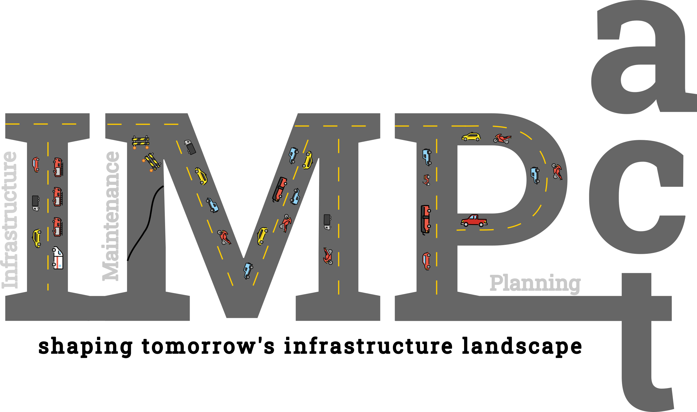

# Welcome to the IMP-act Challenge!

<p align="center">
  
</p>

The IMP-act challenge aims to accelerate the development of inspection and maintenance planning (IMP) of deteriorating engineering systems, such as bridges, aircraft, wind farms, etc. These systems form the fundamental infrastructure on which modern society relies, and adept IMP are quintessential to maximizing the utility we can derive from these systems. This utility summarizes our multifaceted societal, economic, and environmental preferences and values.

In this competition, we focus on inspection and maintenance planning of road networks in Europe. 

```{admonition} **Goal**
**Maximize the overall network performance while minimizing the total cost of inspection and maintenance.**
```

```{admonition} **Challenges**
:class: important

 - **Scalabilty**:
 - **Cooperation**:
 - **Partial Observability**:
 - **Stochasticity**:


```{toctree}
:maxdepth: 3
:caption: Challenge
:hidden:

challenge/general
challenge/rules_and_prizes
challenge/submission
```


```{toctree}
:maxdepth: 3
:caption: Getting Started
:hidden:

getting_started/installation
getting_started/quickstart
```

```{toctree}
:maxdepth: 1
:caption: Tutorials
:hidden:

tutorials/epymarl
tutorials/heuristic
```

```{toctree}
:maxdepth: 3
:caption: Environment
:hidden:

environment/concept
environment/software
```

```{toctree}
:maxdepth: 3
:caption: Baselines
:hidden:

baselines/heuristics
baselines/RL_agents
```