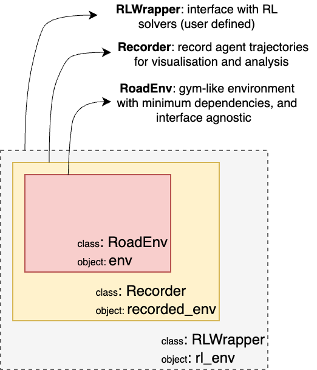

## Overview

This directory is organized as follows:


### Wrappers



#### Recorder Wrapper

An optional wrapper to record the agent's interactions with the environment. This is useful for analyzing the agent's behavior. The Recoder wrapper is available in the `recorder.py` file, and stores the data in `tape` as dict.

Usage:
```python
from imp_act.environments.recorder import Recoder

env = make("ToyExample-v2")
recorded_env = Recorder(env)

for ep in range(10):

    obs = recorded_env.reset()
    done = False

    while not done:
        actions = [[1] * len(e["road_segments"].segments) for e in env.graph.es]

        obs, reward, done, info = recorded_env.step(actions)

# convert the tape to a pandas dataframe
df = recorded_env.tape_to_df()
```
