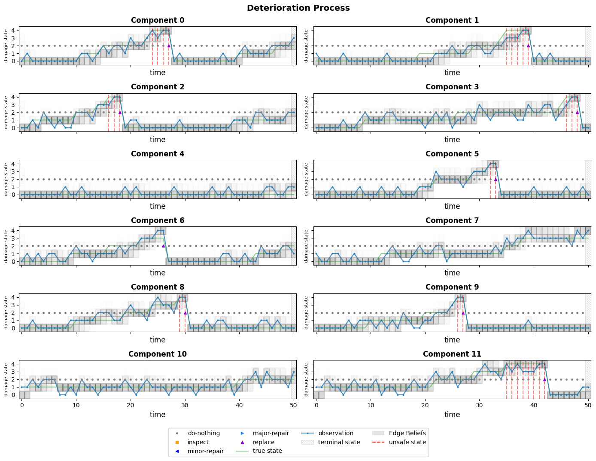
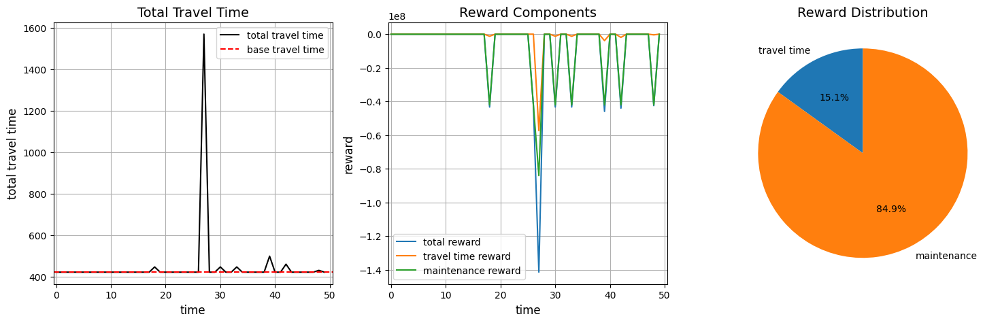
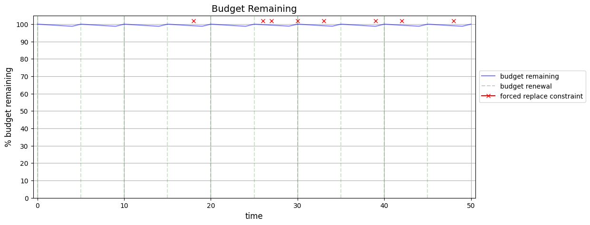
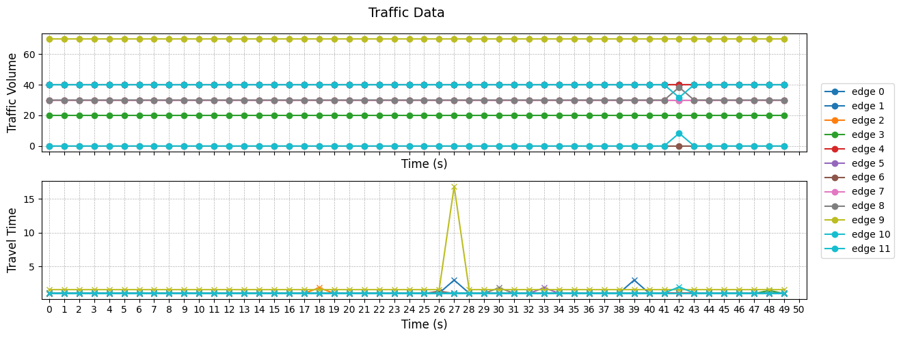

## Overview

This directory is organized as follows:


## Wrappers


### Recorder Wrapper

An optional wrapper to record the agent's interactions with the environment. This is useful for analyzing the agent's behavior. The Recoder wrapper is available in the `recorder.py` file, and stores the data in `rollout_data` as dict.

Usage:
```python
from imp_act import make, Recorder

env = make("ToyExample-v2")
recorded_env = Recorder(env)

for ep in range(10):

    obs = recorded_env.reset()
    done = False

    while not done:
        actions = [[1] * len(e["road_segments"].segments) for e in env.graph.es]

        obs, reward, done, info = recorded_env.step(actions)

# convert the rollout_data to a pandas dataframe
df = recorded_env.rollout_data_to_df()
```

## Rollout Plotter

A utility to plot the agent's interactions with the environment. 

Usage:
```python
from imp_act import RolloutPlotter

# record the agent's interactions with the environment as shown above
rollout_data = recorded_env.rollout_data

plotter = RolloutPlotter(env)

ep = 2 # episode to plot
plotter.plot(episode_data=rollout_data[ep])
```

This will plot 4 figures:

#### Plot 1: Deterioration Process


#### Plot 2: Travel time and rewards


#### Plot 3: Budget


#### Plot 4: Traffic

