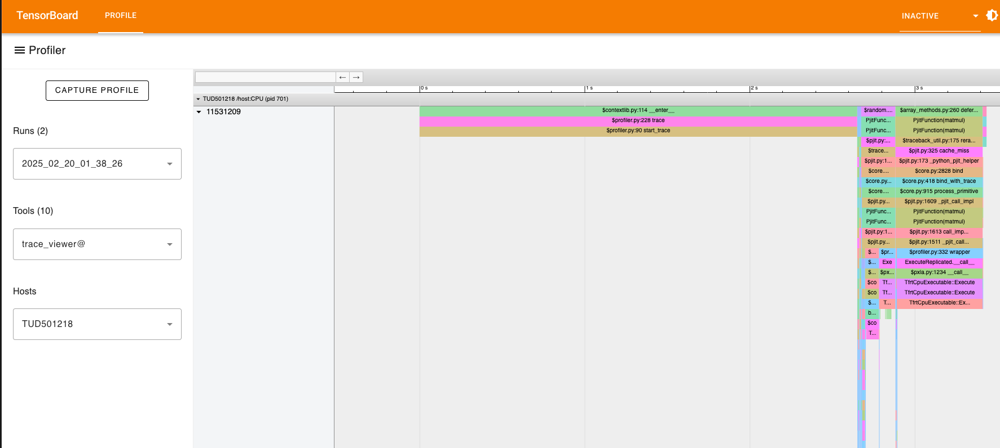

## Requirements

Profiling the JAX code requires `tensorboard` and `tensorboard_plugin_profile`.
The dependencies for can be found under `jax_profiling` in the pyproject.toml file. You can install them via Poetry:

```bash
poetry install --with dev,vis,jax,jax_profiling
```

The lock file is also provided for reproducibility.

## Profiling

Main documentation for profiling can be found in the [JAX documentation](https://docs.jax.dev/en/latest/profiling.html#profiling-computation).

We will follow the [Programmatic capture](https://docs.jax.dev/en/latest/profiling.html#programmatic-capture) method for profiling.

The `jax_profile_example.py` profiles the following code:

```python
import jax

# Run the operations to be profiled
key = jax.random.key(0)
x = jax.random.normal(key, (5000, 5000))
y = x @ x
y.block_until_ready()
```

You can generate the profile by running:

```bash
python jax_profile_example.py
```

This creates a directory `./jax-profile` with the profiling data. You can visualize the profiling data using TensorBoard:

```bash
tensorboard --logdir=./jax-profile
```

(If you cannot see any data, try using a different browser.)

Select the run under "Runs" and trace_viewer in the "Tool" option to visualize the profiling data. It should look like this:


